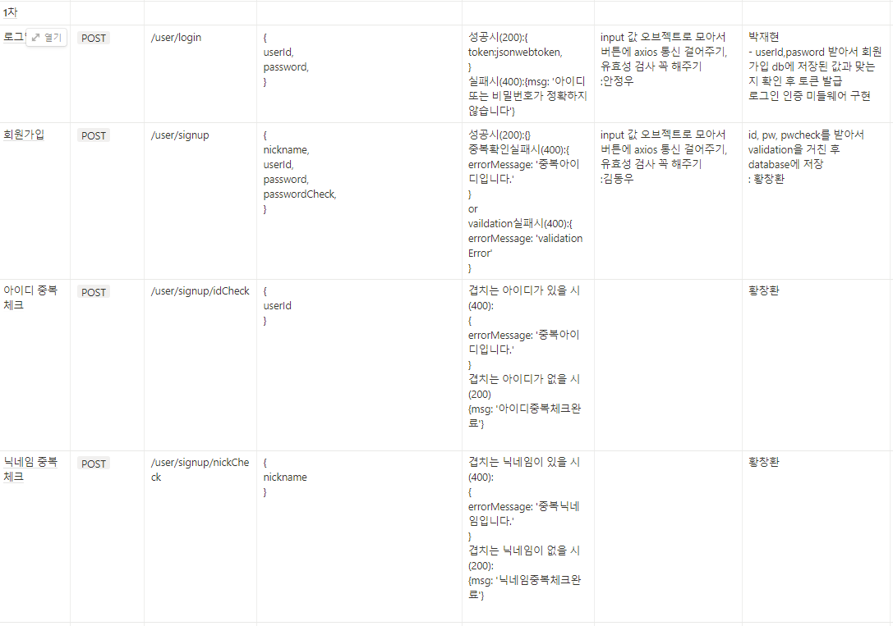
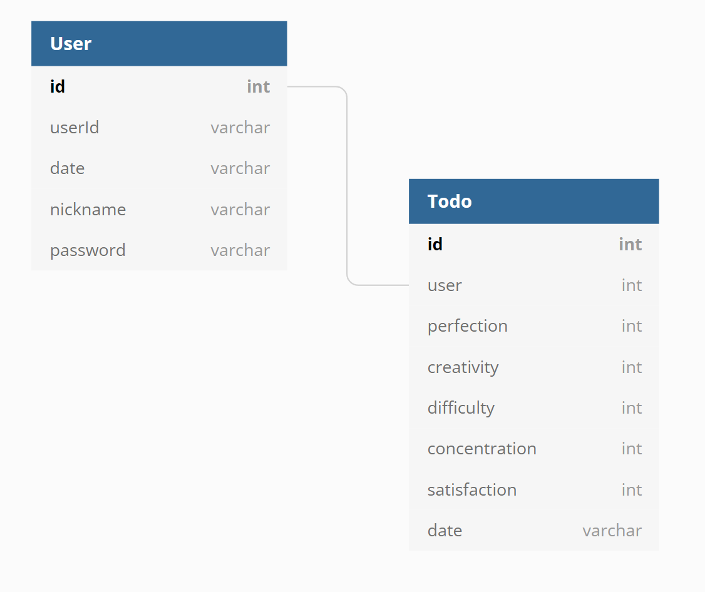

# 항해 미니프로젝트2(셰르파)🏔

[동영상 보러가기](https://www.youtube.com/watch?v=vg4PxshvSmA)

## 개요

다른 사람과의 비교는 필요 없다! 오로지 과거의 나와 비교해서 내가 얼마나 성장했는지, 목표치를 잘 유지하는지를 산 모양의 그래프로 볼 수 있는 항해라는 산의 등산 도우미, 셰르파를 소개합니다.

## 팀원
* Front-end [깃허브 바로가기](https://github.com/d0ngwooK1m/hanghae-sherpa-frontend)
    - 김동우 [깃허브 바로가기](https://github.com/d0ngwooK1m)
    - 안정우 [깃허브 바로가기](https://github.com/jeoungwoo)
* Back-end [깃허브 바로가기](https://github.com/changchanghwang/hanghaeSherpa_back_end)
    - 황창환 [깃허브 바로가기](https://github.com/changchanghwang)
    - 박재현 [깃허브 바로가기](https://github.com/parkjh9370)

## 기간
* 20211011 ~ 20211016(6일간)

## 공통

1. 로그인 회원가입
2. 데이터베이스 그래프화

## 프론트엔드

그래프 라이브러리 d3사용

김동우:  회원가입 페이지, 메인페이지 그래프, Text, Input

안정우: 로그인 페이지, 메인페이지 작성 파트, Grid, Btn

## 백엔드

박재현: 로그인 기능, 로그인 인증 기능, 한 일 저장 기능, 스웨거 작성

황창환: 회원가입 기능, 페이지 뷰 기능, 테스트코드

### 라이브러리
라이브러리 | 설명
---|:---:
 | 비밀번호 암호화
 | 교차 리소스 공유
  | 환경변수 관리
 | 서버
  | 입력데이터 검출
  | 서명 암호화
 | 보안 라이브러리
 | Http Log 기록
  | 데이터베이스
  | MySQL ORM
 | MySQL ORM Console
  | 날짜 라이브러리
  | 테스트 코드
 | API 문서화
 | 서버 부하 테스트
 | 코드 포멧팅

## 와이어 프레임

## API

## DB diagram

